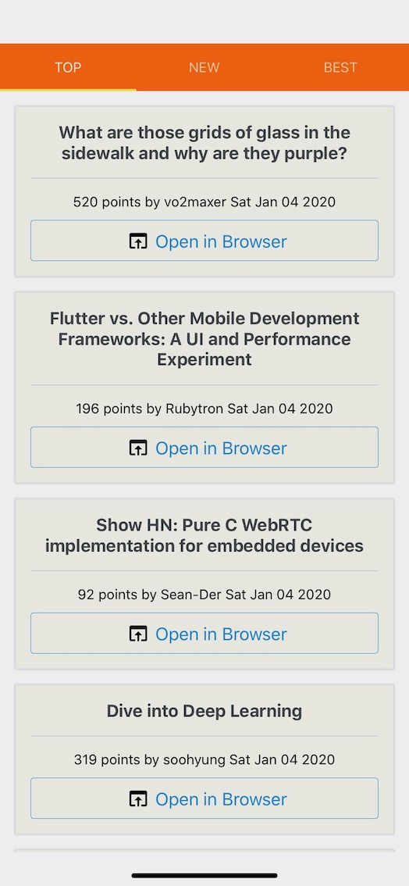

# HackerNewsExpo
[NOTE] This is a sample app for React Native Expo.

A [Hacker News](https://news.ycombinator.com/) client built with [React Native Expo](https://expo.io/).


## Run app
```console
$ git clone https://github.com/ken-tunc/HackerNewsExpo.git && cd HackerNewsExpo
$ npm install
$ npm run start
```

If you want to run app on your devices, [Expo Client](https://expo.io/tools#client) is required.

Also you can run app [on Android/iOS emulators](https://expo.io/tools#client). 

## License
See [LICENSE](./LICENSE).
